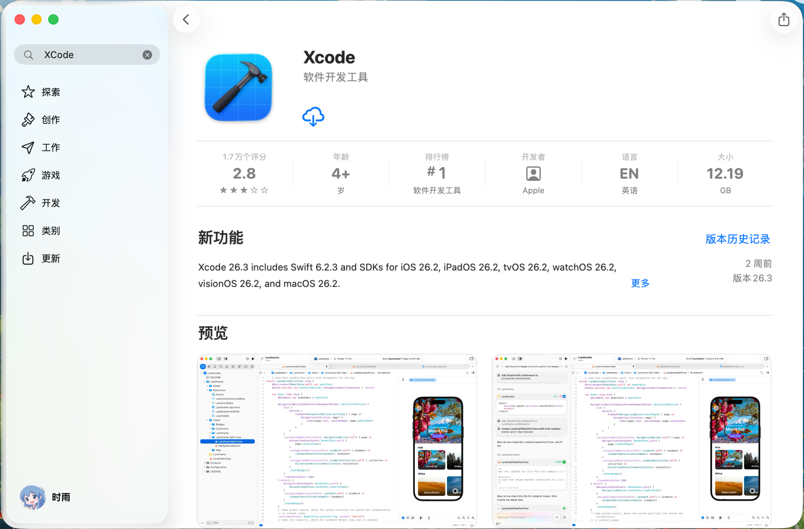
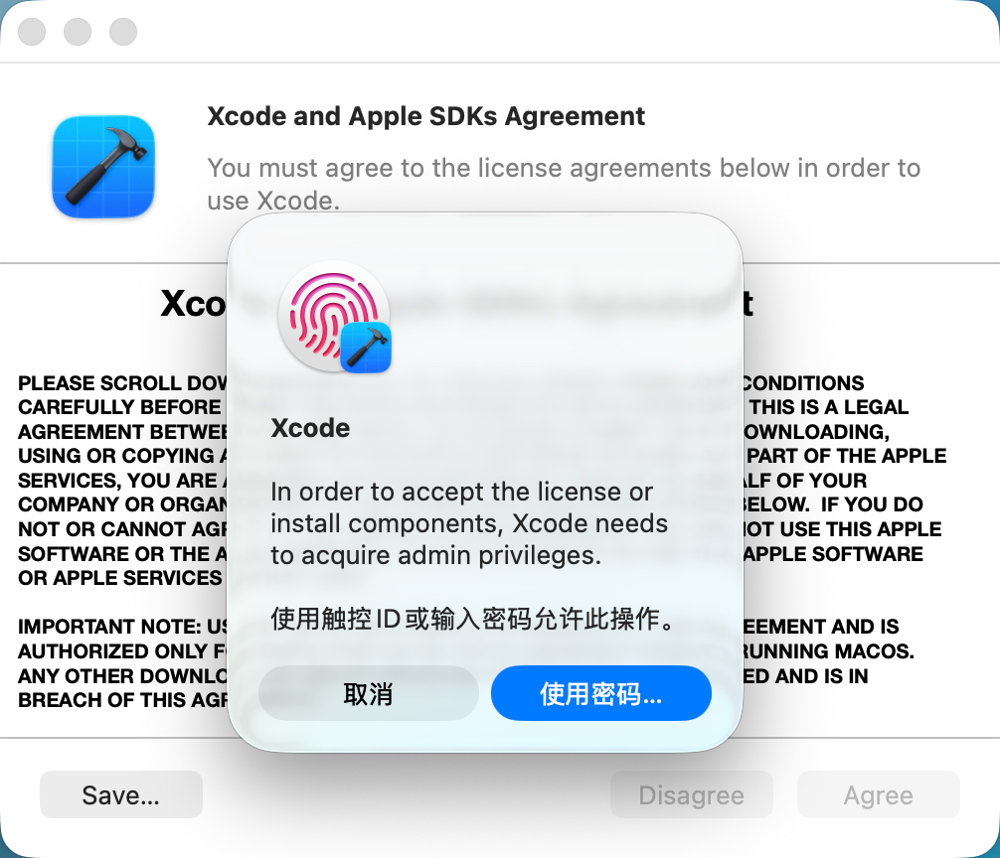
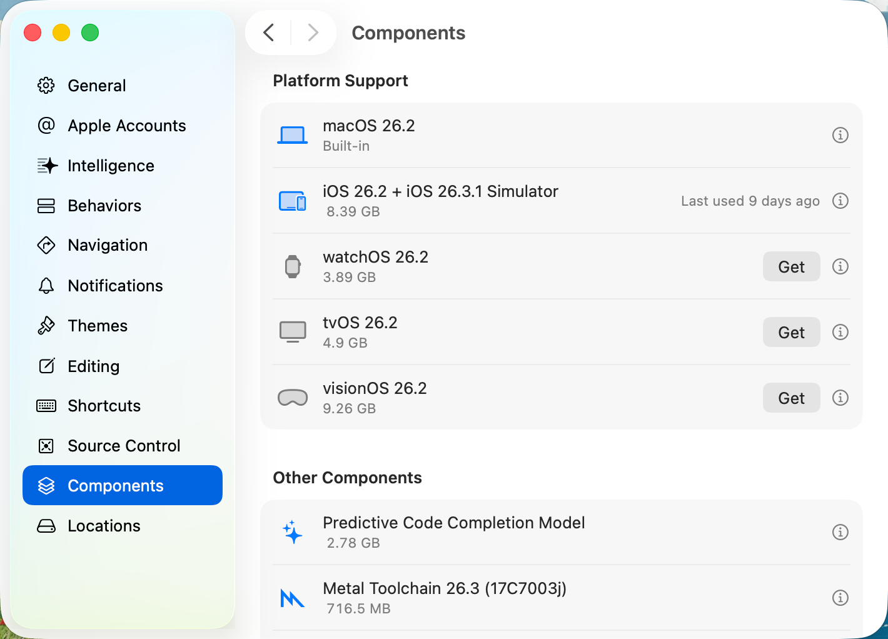
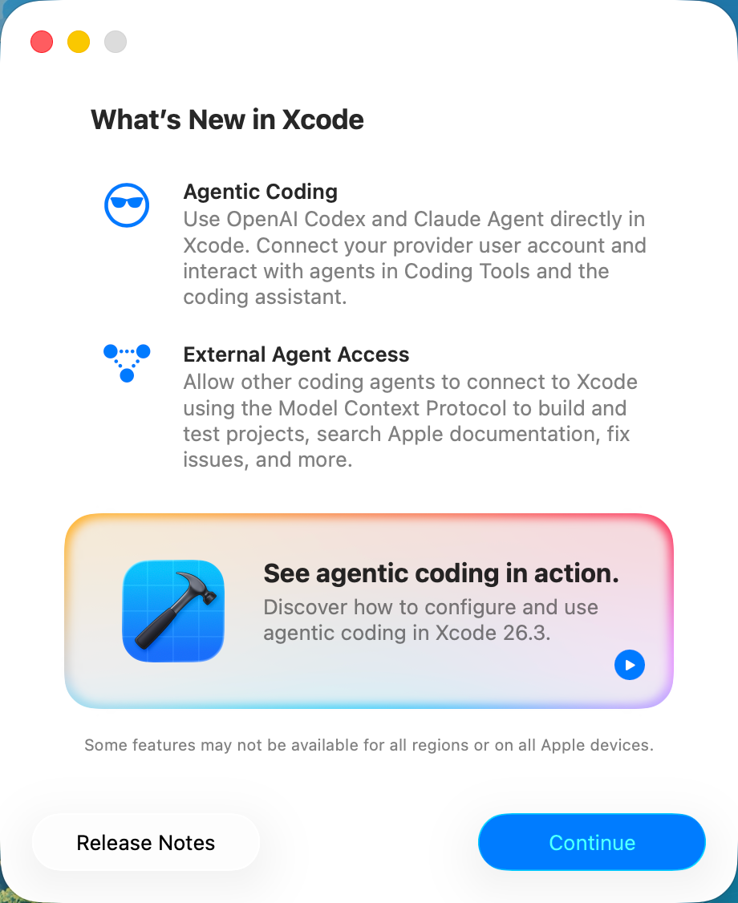

# 01. 环境搭建

> 草稿说明：本章面向第一次接触 Swift 的读者，目标是先把开发环境稳定搭起来，并完成最基础的安装验证。

## 本章目标

学完这一章后，你应该能够：

- 理解学习 Swift 为什么通常需要先准备 Xcode
- 在 macOS 上安装 Xcode 和命令行工具
- 在终端中确认 Swift 已经可用
- 知道后续教程中的代码主要会在哪里运行

## 为什么要先搭建环境

很多语言都可以先写代码，再慢慢补工具链；但对 Swift 初学者来说，环境本身就是学习体验的一部分。

这是因为后续教程里的许多示例会涉及：

- Xcode 工程
- Swift 编译器
- 调试和运行按钮
- 终端里的 `swift` 命令

如果环境没有提前准备好，读者在真正开始写代码之前，就很容易被安装问题打断节奏。因此，我们先把环境搭好，再进入语法学习。

## 本教程采用什么环境

本教程默认使用下面这套组合：

- 操作系统：macOS
- 开发工具：Xcode
- 命令行工具：Xcode Command Line Tools

这样安排有两个原因：

1. Xcode 是学习 Swift 最直接、最完整的官方工具。
2. 后续教程中的示例 demo 会以 Xcode 工程的形式组织。

如果你暂时不熟悉终端，也没有关系。初学阶段你只需要学会两件事：

- 能在 Xcode 里创建并运行项目
- 能在终端里执行少量验证命令

## 第一步：安装 Xcode

### 方式一：通过 App Store 安装

这是最适合初学者的方式。

操作步骤：

1. 打开 App Store
2. 搜索 `Xcode`
3. 点击安装
4. 等待下载和安装完成

安装完成后，建议先启动一次 Xcode。第一次启动时，系统可能会提示你安装额外组件。按照提示完成即可。



上图展示了在 App Store 中搜索并找到 Xcode 后的页面。初学者可以先确认自己安装的是 Apple 官方提供的 Xcode。

### 为什么推荐先安装完整的 Xcode

有些读者会先接触到“只安装命令行工具也可以写 Swift”。这句话并不完全错，但不适合本教程的起点。

因为本教程后续会大量使用：

- Xcode 工程
- Xcode 的运行和调试功能
- 与 Apple 平台开发相关的默认工具链

所以，最稳妥的做法是先安装完整的 Xcode，再补齐命令行工具。

## 第二步：安装命令行工具

即使你已经安装了 Xcode，命令行工具仍然值得单独确认一次。它会提供后续常用的一些终端命令，例如：

- `swift`
- `xcode-select`

你可以打开终端，执行：

```bash
xcode-select --install
```

执行后，系统通常会出现安装提示窗口。

可能出现两种情况：

- 如果还没有安装命令行工具，系统会提示你继续安装
- 如果已经安装过，系统会提示该组件已经存在

这两种情况都正常。

例如，如果你的系统已经安装过命令行工具，终端可能会显示类似下面的内容：

```bash
shiyu@MacBook-Pro ~ % xcode-select --install
xcode-select: note: Command line tools are already installed. Use "Software Update" in System Settings or the softwareupdate command line interface to install updates
```

这里的重点是：这不是报错，而是提示你当前机器上已经安装了命令行工具。如果后续只是为了学习本教程，那么看到这条提示通常说明这一步已经完成了。

## 第三步：确认 Xcode 工具链可用

安装完成后，建议先做两个最基本的检查。

### 检查 1：确认系统能找到开发者工具目录

在终端执行：

```bash
xcode-select -p
```

如果安装正常，你会看到一段路径输出。它通常表示当前系统正在使用的开发者工具位置。

例如，正常情况下你可能会看到：

```bash
shiyu@MacBook-Pro ~ % xcode-select -p
/Applications/Xcode.app/Contents/Developer
```

如果你的机器上已经卸载了 Xcode，但仍然保留了独立安装的命令行工具，那么也可能看到下面这样的输出：

```bash
shiyu@MacBook-Pro ~ % xcode-select -p
/Library/Developer/CommandLineTools
```

这同样说明系统里仍然存在可用的开发者工具链，只是当前指向的是独立的 Command Line Tools，而不是完整的 Xcode。

你不需要记住这条路径的具体内容，只需要知道：

- 有输出，通常说明工具链已经可用
- 如果提示找不到相关内容，通常说明 Xcode 或命令行工具没有正确安装

例如，如果系统中既没有可用的 Xcode 工具链，也没有可用的 Command Line Tools，那么你可能会看到下面这样的输出：

```bash
shiyu@MacBook-Pro ~ % xcode-select -p
xcode-select: error: Unable to get active developer directory. Use `sudo xcode-select --switch path/to/Xcode.app` to set one (or see `man xcode-select`)
```

这说明当前系统没有可用的活跃开发者目录。对初学者来说，最直接的处理方式通常是：

1. 如果你已经安装了 Xcode，就先启动一次 Xcode，完成首次初始化
2. 如果你还没有安装命令行工具，就执行 `xcode-select --install`
3. 完成后重新执行 `xcode-select -p` 和 `swift --version` 进行验证

### 检查 2：确认 Swift 编译器可用

继续执行：

```bash
swift --version
```

如果一切正常，你会看到 Swift 的版本信息。

例如，正常情况下你可能会看到：

```bash
shiyu@MacBook-Pro ~ % swift --version
swift-driver version: 1.127.15 Apple Swift version 6.2.4 (swiftlang-6.2.4.1.4 clang-1700.6.4.2)
Target: arm64-apple-macosx26.0
```

这一步的意义不是让你记住版本号，而是确认两件事：

- `swift` 命令已经可以在终端中使用
- 你的系统已经具备运行后续命令行示例的基础条件

如果系统中还没有可用的开发者工具，那么你可能会看到类似下面的输出：

```bash
shiyu@MacBook-Pro ~ % swift --version
xcode-select: note: No developer tools were found, requesting install.
If developer tools are located at a non-default location on disk, use `sudo xcode-select --switch path/to/Xcode.app` to specify the Xcode that you wish to use for command line developer tools, and cancel the installation dialog.
See `man xcode-select` for more details.
```

这说明 `swift` 命令本身还不能正常工作，系统检测到当前没有可用的开发者工具，因此开始请求安装。对初学者来说，看到这条输出时，可以把它理解为“Swift 环境还没有准备好”。

这时通常可以按下面的顺序处理：

1. 如果你已经安装了 Xcode，就先打开一次 Xcode，完成首次初始化
2. 执行 `xcode-select --install` 安装命令行工具
3. 安装完成后重新执行 `xcode-select -p`
4. 再重新执行 `swift --version`

## 第四步：第一次打开 Xcode 时要注意什么

很多初学者在安装完 Xcode 后，看到界面就会急着开始写代码。但在正式开始之前，建议先完成下面几件事：

1. 打开一次 Xcode
2. 等待它完成首次初始化
3. 如果系统提示安装额外组件，就按提示完成
4. 确认 Xcode 可以正常启动，不会立刻报错退出

这一步看起来很简单，但很重要。很多“明明已经安装了 Xcode 却跑不起来”的问题，其实都出在首次启动没有完成初始化。



如果你在首次启动过程中看到类似上图的授权或密码确认窗口，这是正常现象。Xcode 在安装组件、接受许可或写入系统级配置时，可能需要管理员权限。

另外，建议你在第一次配置环境时，把 macOS 和 iOS 两个版本的相关组件都安装好。

这样做的原因不是为了让你一开始就同时开发两个平台，而是因为本教程后续会逐步涉及跨平台开发相关的知识。如果当前只安装了 macOS 相关组件，后面学习到 iOS 相关内容时，可能还需要重新返回工具设置界面补装依赖，打断学习节奏。

如果你发现当前只安装了 macOS 版本，可以在下面的位置继续安装其他平台组件：

1. 打开 Finder
2. 进入 `Applications`
3. 找到并打开 `Xcode`
4. 进入 `Settings`
5. 打开 `Components`

在这个页面中，你可以看到可安装的平台组件。如果后续教程会涉及 iOS 内容，建议在这里把 iOS 相关组件也提前安装完成。



上图展示了 `Xcode > Settings > Components` 页面。在这里你可以查看当前已经安装的平台支持情况，并按需安装 iOS、watchOS、tvOS 或 visionOS 等相关组件。



首次启动完成后，你可能会看到类似这样的欢迎或更新说明界面。这通常表示 Xcode 已经成功启动，基础环境至少已经进入可用状态。

## Swift 代码通常会在哪里运行

在本教程中，Swift 代码大致会出现在两种场景里。

### 场景一：在 Xcode 工程中运行

这是本教程最主要的方式。

你会：

- 打开一个 `.xcodeproj`
- 查看项目中的 Swift 文件
- 点击运行按钮
- 在控制台里查看输出结果

这种方式最适合初学者，因为它更直观，也更接近后续真实开发的使用方式。

### 场景二：在终端里运行简单命令

有些非常短的小例子，可能会用终端来验证环境或展示最基础的语言行为。

例如：

```bash
swift --version
```

后面如果需要，我们也会逐步介绍如何在终端里运行简单的 Swift 代码。但在当前阶段，你不需要一次掌握太多终端知识。

## 常见问题

### 1. 我已经安装了 Xcode，为什么终端里还是找不到 `swift`？

常见原因有：

- Xcode 还没有完成首次启动初始化
- 命令行工具还没有安装完成
- 当前开发者工具路径没有正确设置

初学阶段最简单的处理方式是：

1. 先启动一次 Xcode
2. 再执行一次 `xcode-select --install`
3. 重新打开终端后再执行 `swift --version`

### 2. 我不是 macOS 用户，可以跟着学吗？

可以学习 Swift 语言本身，但如果你想完整跟随本教程中的 Xcode 示例工程，那么 macOS 会是最直接的选择。

这是因为本教程目前的示例组织方式依赖 Xcode 工程，而 Xcode 只在 macOS 上提供完整体验。

另外，之后会讲到的`Swift.UI`框架仅可在macOS上使用，如果你使用`Linux`或`Windows`，将无法实操这部分内容

### 3. 我需要一开始就学会终端吗？

不需要。

你只需要会执行少量基础命令，用来：

- 验证环境
- 查看 Swift 是否可用

真正的重点仍然是理解 Swift 代码本身。

## 本章小结

在进入 Swift 语法之前，你现在应该已经完成了下面几件事：

- 安装 Xcode
- 安装或确认 Xcode Command Line Tools
- 使用 `xcode-select -p` 检查工具链路径
- 使用 `swift --version` 检查 Swift 是否可用

如果这些步骤都已经完成，那么你就可以进入下一章，开始正式学习 Swift 的基础语法。

## 本章练习

请你自己完成下面三个检查：

1. 成功打开 Xcode 一次
2. 在终端执行 `xcode-select -p`
3. 在终端执行 `swift --version`

如果这三步都能顺利完成，说明你的基础环境已经准备好了。
