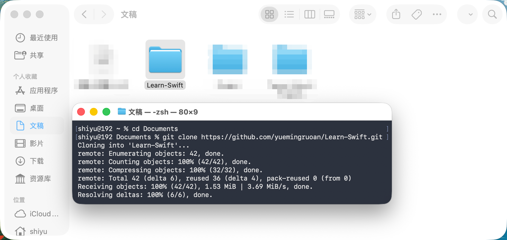

# 02. Git 基础与拉取项目

## 阅读导航

- 前置章节：[01. 环境搭建](./01-environment-setup.md)
- 上一章：[01. 环境搭建](./01-environment-setup.md)
- 建议下一章：[03. Xcode 基础使用](./03-xcode-basics.md)
- 下一章：[03. Xcode 基础使用](./03-xcode-basics.md)
- 适合谁先读：需要拉取课程仓库并开始做课后作业的读者

## 本章目标

学完这一章后，你应该能够：

- 理解 Git 是什么
- 理解什么是仓库（repository）
- 知道 `clone` 这个操作的含义
- 使用 `git clone` 把课程项目拉到本地
- 知道课后作业为什么要先从仓库开始

## 为什么要先学一点 Git

从这一章开始，课程会逐步加入课后作业。

这意味着你不再只是“看教程”，还需要：

- 获取我提供的项目
- 在自己的电脑上打开它
- 基于这个项目继续练习

如果没有最基础的 Git 概念，很多初学者一开始就会卡在这里：

- 不知道项目该去哪里下载
- 不知道为什么别人发的是一个仓库地址
- 不知道 `clone` 和普通下载 zip 有什么区别

所以，在正式进入后续练习之前，我们先补上这块最基础的 Git 知识。

## 什么是 Git

Git 是一种版本控制工具。

你可以先把它理解成一个“专门用来记录项目历史变化的工具”。

它和普通保存文件最大的区别在于：

- 普通保存只保留当前状态
- Git 会帮助你记录项目是怎么一步一步变化的

Git 最常见的作用包括：

- 记录代码修改历史
- 回看过去的版本
- 和别人协作开发同一个项目
- 把项目托管到 GitHub 等平台上

对初学者来说，当前阶段你只需要先抓住一个核心概念：

- Git 不只是“下载代码”
- Git 更重要的作用是“管理项目版本”

## 什么是仓库

在 Git 的语境里，仓库通常对应英文里的 `repository`，很多时候也会直接写成 `repo`。

你可以先把仓库理解成：

- 一个项目的完整版本管理目录

它里面通常不只包含代码文件本身，还包含这个项目的版本历史信息。

所以，当课程说“去拉取仓库”时，意思通常不是：

- 随便下载几个代码文件

而是：

- 把这个项目连同它的 Git 管理信息一起拿到本地

## 什么是 clone

`clone` 是 Git 里非常常见的一个动作。

你可以把它理解成：

- 从远程仓库复制一份完整项目到自己的电脑上

这里的“完整”，不仅仅包括项目文件本身，还包括这个仓库的版本管理信息。

这就是为什么 `git clone` 和“在网页上下载一个 zip 压缩包”不是完全一样的。

### clone 和直接下载 zip 有什么区别

对于初学者来说，可以先这样理解：

- 下载 zip：拿到的是一份文件副本
- `git clone`：拿到的是一份带 Git 历史和版本管理能力的项目副本

如果课程后面只让你看代码，那么下载 zip 有时也能工作。

但如果课程后面还会涉及：

- 提交作业
- 更新项目内容
- 同步老师的新修改

那么使用 `git clone` 才是更合适的方式。

## 本课程项目的仓库地址

本课程当前使用的仓库地址是：

```text
https://github.com/yuemingruoan/Learn-Swift.git
```

后面如果你要把课程项目拉到本地，就会用到这个地址。

## 如何把项目拉到本地

### 第一步：打开终端

你可以先打开 macOS 的终端程序。

如果你之前已经按照第 1 章完成了环境准备，那么打开终端后应该已经可以正常输入命令。

### 第二步：进入你想保存项目的位置

例如，如果你希望把课程项目放到 `Documents/Project` 目录，可以先执行：

```bash
cd ~/Documents/Project
```

如果这个目录还不存在，也可以先创建它：

```bash
mkdir -p ~/Documents/Project
cd ~/Documents/Project
```

这里的重点不是必须放在哪个固定目录，而是你自己之后能稳定找到它。

### 第三步：执行 git clone

然后执行：

```bash
git clone https://github.com/yuemingruoan/Learn-Swift.git
```

执行成功后，Git 会在当前目录下创建一个新的文件夹：

```text
Learn-Swift
```

这个文件夹里就是课程项目的本地副本。

例如，正常情况下你可能会看到类似下面的输出：

```bash
shiyu@192 Documents % git clone https://github.com/yuemingruoan/Learn-Swift.git
Cloning into 'Learn-Swift'...
remote: Enumerating objects: 42, done.
remote: Counting objects: 100% (42/42), done.
remote: Compressing objects: 100% (32/32), done.
remote: Total 42 (delta 6), reused 36 (delta 4), pack-reused 0 (from 0)
Receiving objects: 100% (42/42), 1.53 MiB | 3.69 MiB/s, done.
Resolving deltas: 100% (6/6), done.
```

你不需要记住这些输出里每一行的含义。对当前阶段来说，最重要的是确认：

- 没有报错中断
- 当前目录里成功出现了 `Learn-Swift` 文件夹



上图展示了 `git clone` 成功后的一个典型状态：终端里没有出现报错，同时 Finder 中已经能看到新生成的 `Learn-Swift` 文件夹。对初学者来说，这基本就说明项目已经成功拉取到本地了。

## clone 完成后该做什么

当你执行完 `git clone` 之后，通常下一步是进入项目目录：

```bash
cd Learn-Swift
```

然后你就可以：

- 查看项目文件
- 用 Xcode 打开相关工程
- 开始完成课程中的练习

## 为什么课后作业要从 clone 开始

因为从这一章开始，课后作业不再只是让你“手动敲几行代码”。

你更可能需要：

- 在既有项目基础上继续完成任务
- 使用课程已经准备好的目录结构
- 直接打开现成的工程文件

如果每个同学都用自己随手建的目录，后面的作业说明会变得很混乱。通过让大家先拉取同一个仓库，可以保证大家看到的是同一套基础项目结构。

## 如果终端提示找不到 git 怎么办

在本教程的环境下，Git 通常会随着 Xcode Command Line Tools 一起可用。

也就是说，当你在第一章里正确安装了 Xcode 命令行工具之后，终端里通常也就可以直接使用 `git` 命令了。

所以，如果你在这里发现系统提示找不到 `git`，那么更大的可能不是“Git 单独坏了”，而是：

- 第 1 章里的环境没有安装完整
- Xcode Command Line Tools 还没有正确配置好

你可以先执行：

```bash
git --version
```

如果能看到版本号，说明 Git 已经可用。

例如，正常情况下你可能会看到类似下面的输出：

```bash
shiyu@192 ~ % git --version
git version 2.50.1 (Apple Git-155)
```

如果不能正常执行，那么通常说明：

- 开发者工具还没有准备好
- 当前终端环境还不能使用 Git

这时建议先回到第 1 章，再确认 Xcode 和命令行工具是否已经正确安装，而不要急着把问题当成单独的 Git 故障。

## 本章小结

学完这一章后，你应该已经理解了：

- Git 是什么
- 仓库是什么
- `clone` 的含义是什么
- 为什么课程项目更适合用 `git clone` 获取
- 如何把 `Learn-Swift` 仓库拉到本地

这一步完成之后，你就具备了跟随后续课程和课后作业的基础条件。

## 本章练习

请你自己完成下面几件事：

1. 在终端中执行 `git --version`
2. 选择一个你自己容易找到的目录
3. 执行 `git clone https://github.com/yuemingruoan/Learn-Swift.git`
4. 进入 `Learn-Swift` 目录
5. 确认你能看到仓库中的文件结构

如果这几步都完成了，说明你已经具备了开始做课后作业的基础条件。
