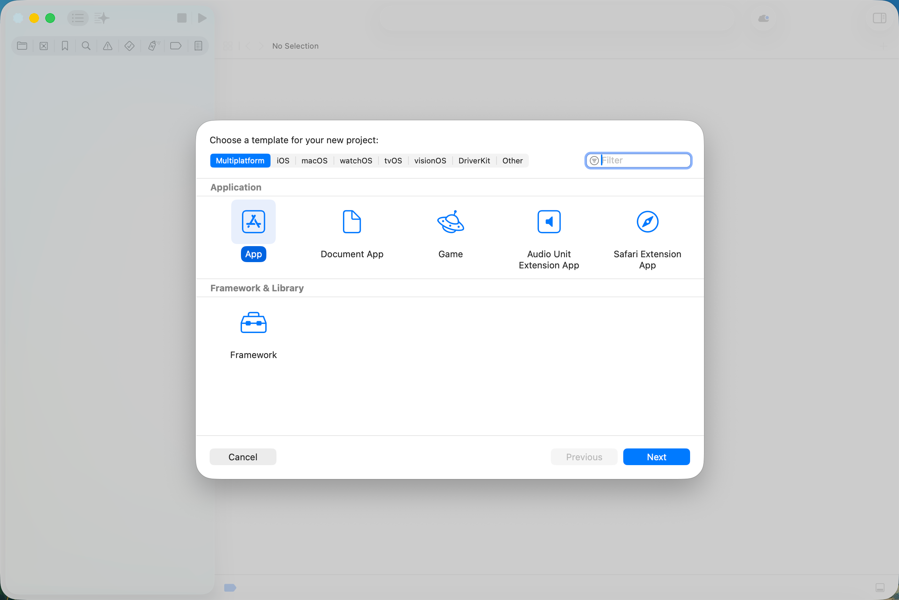
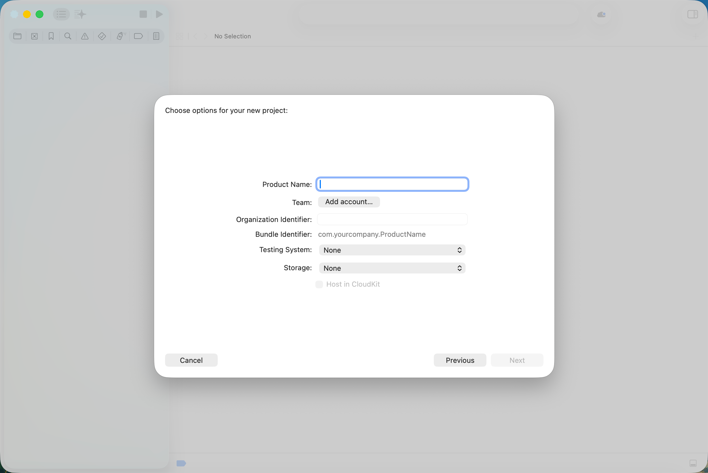
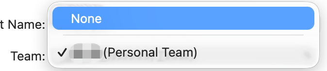
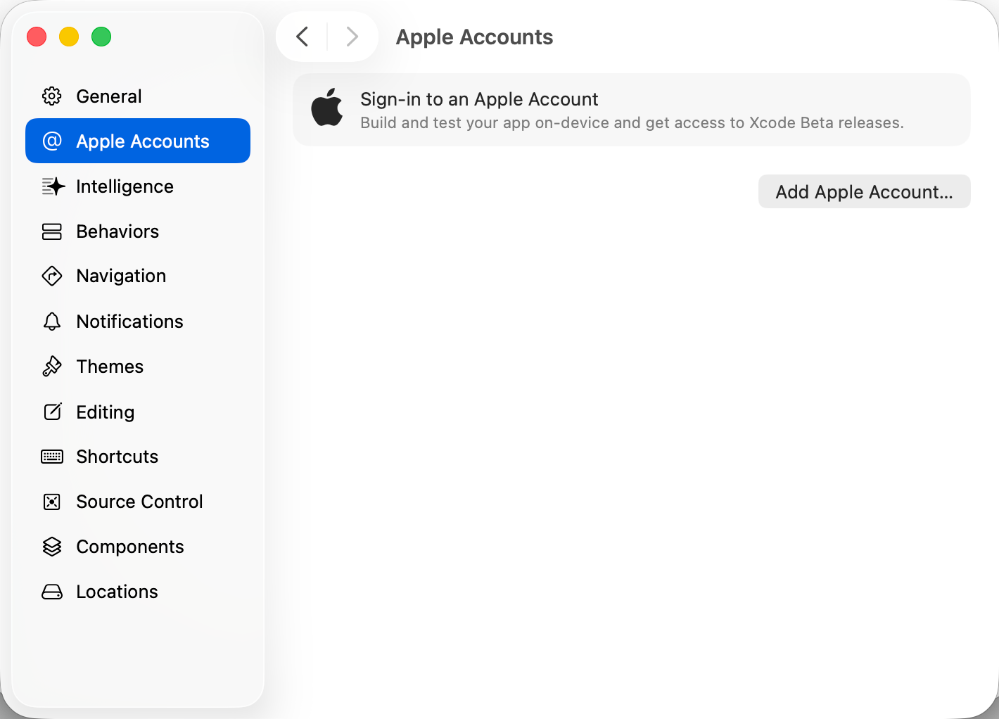
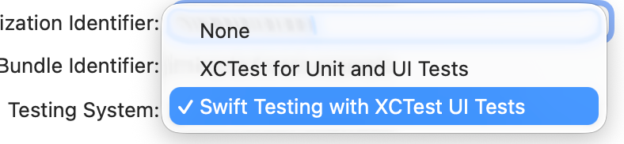
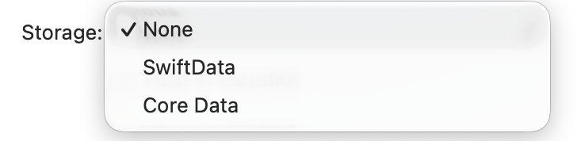
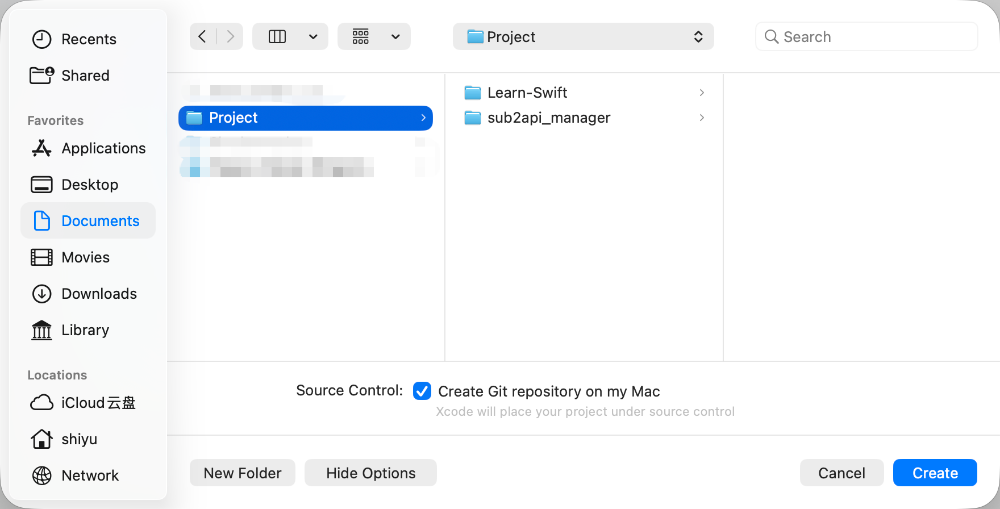
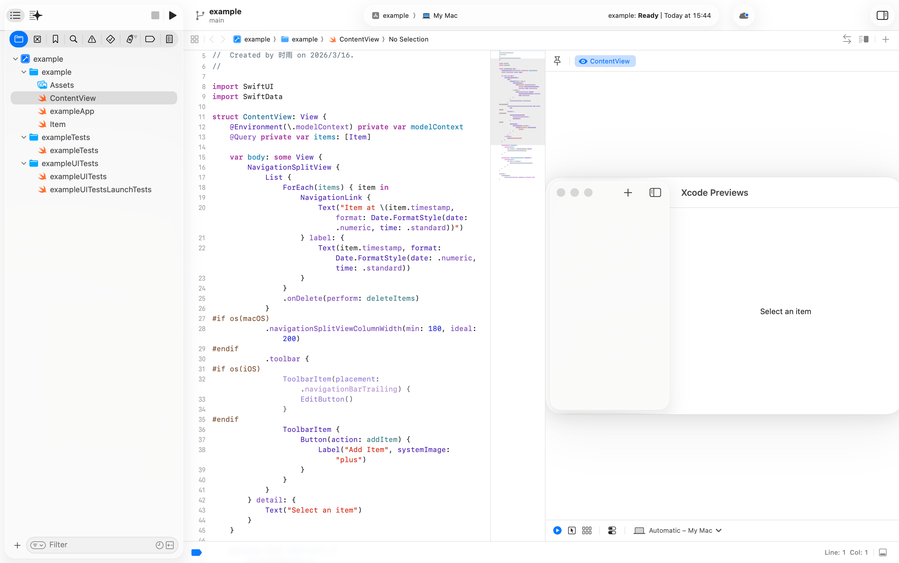

# 03. Xcode 基础使用

## 阅读导航

- 前置章节：[01. 环境搭建](./01-environment-setup.md)、[02. Git 基础与拉取项目](./02-git-basics.md)
- 上一章：[02. Git 基础与拉取项目](./02-git-basics.md)
- 建议下一章：后续 Swift 基础语法章节（待补充）
- 下一章：后续 Swift 基础语法章节（待补充）
- 适合谁先读：已经完成环境准备并成功拉取课程项目的读者

## 本章目标

学完这一章后，你应该能够：

- 看懂 Xcode 首页最常见的入口
- 创建一个新的 Xcode 项目
- 打开一个已经存在的 Xcode 项目
- 知道如何运行一个项目
- 初步理解 Xcode 主窗口里最常见的几个区域

## 为什么要先学 Xcode 的基础操作

如果你完全没有接触过 IDE，那么第一次打开 Xcode 时，最容易出现的问题不是“代码不会写”，而是：

- 不知道该点哪里
- 不知道该创建哪一种项目
- 不知道项目开了之后怎么运行
- 不知道左边、右边、上面的区域分别是做什么的

这些问题如果不先解决，后面学习 Swift 语法时就会不断被工具本身打断。因此，在正式进入语言内容之前，我们先把最常用的操作路径理顺。

## 什么是 Xcode

Xcode 是 Apple 官方提供的开发工具。你可以把它简单理解成一个“写代码、管理项目、运行程序、调试程序”的综合工作台。

在后续教程中，你最常和 Xcode 打交道的事情主要有：

- 创建项目
- 打开示例工程
- 编辑 Swift 文件
- 运行程序
- 查看输出结果

在入门阶段，你不需要一次学完它的全部功能。先掌握最常用的主流程就够了。

## Xcode 首页介绍

当你启动 Xcode，但还没有打开任何项目时，通常会看到欢迎页面。这个页面可以理解成 Xcode 的起点页面。

在这里，初学者最需要关注的通常只有下面几个入口：

- `Create a new Xcode project`
- `Open an existing project or file`
- 最近打开过的项目列表


上图就是 Xcode 的欢迎页。对于初学者来说，这一页最重要的就是“新建项目”和“打开现有项目”两个入口。

如果你对全英文界面还不熟悉，可以先记住这一组最常用的对应关系：

- `Create New Project...`：新建项目
- `Open Existing Project...`：打开现有项目

在本课程后面的练习里，当你需要打开我已经准备好的 demo 时，通常就会用到 `Open Existing Project...` 这个入口。

### 1. Create a new Xcode project

这个入口用于新建项目。

如果你想从零开始创建一个新的 Swift 工程，通常就是从这里进入。

### 2. Open an existing project or file

这个入口用于打开已经存在的项目或文件。

在本教程里，后续很多示例 demo 都会是现成的 Xcode 工程，所以你会频繁使用这个入口。

### 3. Recent Projects

欢迎页通常还会显示最近打开过的项目列表。

如果你之前已经打开过某个工程，通常可以直接从这里重新进入，而不必每次都手动去 Finder 中查找文件。

## 第一次创建项目前，要先知道什么

很多初学者第一次点击“新建项目”后，会立刻看到很多模板，于是马上开始慌张。其实你不用急着理解所有模板。

在本教程的当前阶段，你只需要知道一件事：

- 我们只会先用最基础、最常见的模板

你现在不需要区分所有 Apple 平台模板，也不需要理解复杂的工程类型。先学会“创建一个最基本的项目并成功运行”就够了。

## 如何新建一个项目

### 第一步：进入新建项目页面

在 Xcode 欢迎页中，点击：

```text
Create a new Xcode project
```

之后 Xcode 会弹出模板选择页面。

### 第二步：选择合适的模板

在初学阶段，建议你先选择最基础、最容易理解的项目模板。

你会看到不同平台和不同类型的模板，例如：

- macOS
- iOS
- App
- Game
- Framework

对于刚开始学习 Swift 的读者来说，重点不是模板种类本身，而是先学会：

- 这是一个“应用项目”
- 它属于哪个平台

在本教程后续内容中，我们会根据具体示例告诉你应该使用哪个模板。当前阶段，你只需要知道模板的作用是“告诉 Xcode 你准备创建哪一类项目”。



这张图展示了新建项目时的模板选择页面。初学阶段你不需要一次理解所有平台和模板，只需要先学会选择一个最基础的 `App` 模板即可。

### 第三步：填写项目基本信息

选好模板后，Xcode 通常会要求你填写一些基础信息，例如：

- Product Name
- Organization Identifier
- Team
- Testing System
- Storage

初学者在这里最需要关注的是下面几项：

1. `Product Name`
2. `Team`
3. `Testing System`
4. `Storage`



上图展示的是项目信息填写页面。第一次看到这个页面时不需要紧张，并不是每一个字段你都必须马上完全理解。

#### Product Name

它可以理解成项目名。

例如，你创建一个练习项目时，可以填写：

```text
HelloSwift
```

#### Team

有些项目模板会显示 `Team` 字段，用来选择 Apple 开发者账号相关的签名配置。

对当前教程的入门阶段来说，你可以先把它理解成一个“和账号签名有关的可选项”。如果你只是做最基础的学习和本地运行，通常不需要先深入研究它。



如果这里出现了你自己的账号或 `Personal Team`，说明 Xcode 已经识别到了可用账号；如果没有，也不代表你现在就不能继续学习本教程中的基础内容。

如果你后续需要登录 Apple 账号，可以在 Xcode 的设置中进入账号页面：



这个页面对应 `Xcode > Settings > Apple Accounts`，用于登录或管理 Apple 账号。

需要特别说明的是：在新版 Xcode 中，你通常已经无法像早期版本那样在这里为这类新项目选择 `Objective-C` 或 `Swift`，也不会再看到单独的 `Language` 选项。

这意味着在当前这类项目创建流程中，Swift 已经成为默认语言之一。对本教程来说，这是好事，因为你不需要在第一步就纠结“应该选 Swift 还是 Objective-C”。

#### Testing System

有些模板会让你选择测试系统，例如使用传统的 `XCTest`，或者更新的 `Swift Testing` 组合。



这里可以先把几个选项理解成“Xcode 要不要顺手帮你把测试代码骨架也准备好，以及准备成什么风格”。

常见含义可以先这样理解：

- `None`：不自动创建测试相关内容。适合只想先快速建一个最小项目、暂时不关心测试的情况。
- `XCTest for Unit and UI Tests`：使用传统的 `XCTest` 测试体系，通常会同时准备单元测试和界面测试的基础结构。
- `Swift Testing with XCTest UI Tests`：使用较新的 `Swift Testing` 体系来组织一部分测试，同时仍然保留基于 `XCTest` 的 UI 测试支持。

对初学者来说，你当前不需要立即掌握测试框架的写法。先知道它的核心作用是“给项目准备测试入口”，就已经足够了。

如果你现在只是想先学会创建项目并运行代码，那么选择最简单、最不会分散注意力的选项也完全合理。

#### Storage

有些模板还会让你选择存储方案，例如：

- `None`
- `SwiftData`
- `Core Data`



这里的“存储”可以先理解成：如果你的应用后面需要把数据保存下来，Xcode 要不要提前帮你接入一套数据持久化方案。

几个常见选项可以先这样理解：

- `None`：不预装任何数据存储方案。适合最简单的学习项目。
- `SwiftData`：Apple 较新的数据持久化方案，适合和现代 Swift 开发方式配合使用。
- `Core Data`：Apple 已经使用很多年的数据持久化方案，功能成熟，但概念相对更多。

在某些情况下，你还会看到下面这个选项：

- `Host in CloudKit`：表示是否把相关数据能力进一步和 Apple 的 CloudKit 云服务结合起来。

更具体地说，如果启用这个选项，应用中的一部分数据就可以进一步和 iCloud 关联起来，从而支持同一用户在多台 Apple 设备之间进行同步，也更方便做云端持久化管理。

你可以先把它理解成“是否要让这套数据能力进一步具备 iCloud 同步和云端托管能力”的开关。

对刚开始学习 Swift 的读者来说，最重要的是先分清两件事：

- “写 Swift 代码”是一回事
- “把程序里的数据长期保存起来”是另一回事

`Storage` 这一组选项主要解决的是第二件事。

所以，在当前入门阶段，如果教程没有特别要求，通常先使用最简单的默认选项即可。`Host in CloudKit` 这类云端相关选项也可以先不启用，不要一开始就把注意力放到数据存储框架和云同步能力上。

### 第四步：选择保存位置

填写完项目信息后，Xcode 会让你选择项目保存路径。

这一步建议你养成一个好习惯：把项目放在你自己容易找到的位置，例如：

- `Documents`
- `Developer`
- 专门用于学习的仓库目录

对初学者来说，最重要的不是路径多“专业”，而是你之后能稳定找到它。



上图展示了项目保存位置的选择界面。你可以在这里决定项目保存到哪个文件夹，同时还会看到底部和版本管理相关的选项。

### Create Git repository on my Mac 是什么

在保存项目的界面底部，你可能会看到：

```text
Create Git repository on my Mac
```

这个选项的意思是：在你创建项目的同时，让 Xcode 顺便在这个项目目录里初始化一个 Git 仓库。

### 什么是 Git

Git 是一种版本控制工具。你可以先把它理解成“帮助你记录项目历史变化的工具”。

它最常见的作用包括：

- 记录代码每一次修改
- 在改错时回看过去的版本
- 在不同阶段保存不同的开发进度
- 与 GitHub 等代码托管平台配合使用

对初学者来说，你可以把 Git 简单理解为：

- 普通保存：只保存当前文件状态
- Git：额外帮你记录“这个项目是怎么一步一步变成现在这样的”

### 这个选项要不要勾选

如果你正在创建一个自己的学习项目，勾选这个选项通常是有好处的。这样 Xcode 会直接帮你把项目纳入版本管理，后面你学习 Git 时也会更方便。

如果你现在还完全不了解 Git，也不用有压力。你可以先知道这不是影响项目能否运行的核心选项，而是一个“是否顺手开启版本管理”的选项。

在本教程当前阶段，你可以这样理解：

- 想顺便开始接触版本管理：可以勾选
- 只想先把项目建起来并运行：暂时不勾选也完全可以

### 第五步：完成创建

保存后，Xcode 会自动打开这个项目。到这一步为止，你就已经成功创建了一个 Xcode 项目。

## 如何打开一个现有项目

在本教程里，你后面会经常接触“已经存在的示例工程”。因此，打开现有项目是一个非常高频的操作。

常见方式有两种。

### 方式一：从欢迎页打开

在欢迎页点击：

```text
Open an existing project or file
```

然后在 Finder 选择你要打开的项目文件。

如果是 Xcode 工程，你通常会打开：

```text
xxx.xcodeproj
```

### 方式二：在 Finder 中直接双击

你也可以直接在 Finder 中找到项目，然后双击对应的 `.xcodeproj` 文件。

如果系统已经把 `.xcodeproj` 关联到 Xcode，那么它就会自动用 Xcode 打开。

### 应该打开哪个文件

这是初学者很容易卡住的点。

如果一个项目目录里有很多文件，你不需要随便点开其中某个 `.swift` 文件来尝试“打开项目”。你真正要打开的，通常是项目文件本身，也就是：

```text
xxx.xcodeproj
```

在后续教程中，我们也会尽量明确告诉你应该打开哪个工程文件。

但对于本章而言，由于需要作为课后练习，我不会给出明确的文件，而仅给出项目目录。

## 打开项目后，Xcode 主窗口怎么看

第一次打开项目时，Xcode 的界面可能会让人觉得信息很多。但对初学者来说，你可以先只记住最重要的几个区域。



上图展示的是新建项目后最典型的一种 Xcode 主窗口状态。虽然界面上看起来元素很多，但如果按照区域来理解，它其实没有那么难。

### 1. 左侧导航区

这里通常用来显示项目里的文件和目录。

你后面最常见的操作是：

- 在左侧找到某个 Swift 文件
- 点击它
- 在中间编辑区查看和修改代码

在上图中，左侧已经展开了项目结构。你可以看到：

- 项目本身
- 资源目录，例如 `Assets`
- Swift 源文件，例如 `ContentView`
- 测试目录，例如 `exampleTests` 和 `exampleUITests`

对初学者来说，先不用一次搞懂所有文件，只要先知道“代码文件通常在左边点开”就够了。

### 2. 中间编辑区

这是你写代码、看代码的主要区域。

当你点击左侧某个文件后，文件内容通常就会显示在这里。

在这张图里，中间显示的就是 `ContentView` 文件内容。后面你阅读教程示例时，大多数时间都会把注意力放在这个区域。

### 3. 顶部工具栏

顶部区域通常会包含：

- 当前 Scheme
- 当前运行目标
- 运行按钮
- 停止按钮

对初学者来说，当前阶段最重要的是知道：

- 三角形按钮通常表示运行
- 方形按钮通常表示停止

在上图中，顶部中间偏左的位置就能看到项目名和运行按钮；顶部中间偏右的位置还能看到当前运行目标，例如图中的 `My Mac`。

### 4. 底部控制台区域

运行程序后，很多输出信息会显示在控制台里。

后续你会经常在这里看到：

- `print` 的输出
- 运行日志
- 报错信息

这也是初学者后面最需要学会观察的区域之一。

如果当前没有展开控制台，这个区域可能不会很显眼。但当你真正开始运行程序、打印输出或排查错误时，它会变得非常重要。

### 5. 右侧预览区

在一些项目类型中，Xcode 右侧还会显示预览区域，例如 SwiftUI 的预览画布。

在上图右侧，你可以看到 `Xcode Previews` 区域。这个区域可以帮助你更直观地查看界面效果，而不一定每次都必须完整运行整个应用。

不过对初学者来说，这一章不需要先深入研究预览系统。你只需要先知道：

- 中间区域是代码
- 右侧区域有时是预览
- 如果你暂时看不懂预览内容，也不影响继续学习基础操作

## 如何运行一个项目

创建或打开项目后，下一步最重要的事情就是运行它。

### 第一步：确认项目已经成功打开

你需要先确认：

- Xcode 主窗口已经打开
- 左侧能看到项目文件
- 中间已经显示某个文件或欢迎内容

### 第二步：确认顶部运行区域

在顶部工具栏中，Xcode 会显示当前要运行的配置和目标环境。

初学阶段你不需要深入理解所有运行配置，但你至少要知道：

- Xcode 需要知道“要运行哪个项目”
- 还需要知道“运行到哪里”

### 第三步：点击运行按钮

点击顶部工具栏中的运行按钮，也就是常见的三角形按钮。

Xcode 会开始构建并运行项目。

第一次运行某些项目时，可能会稍微慢一点。这通常是正常现象，因为 Xcode 需要先完成一些准备工作。

### 第四步：观察运行结果

运行后，你可能会看到几种不同结果：

- 程序正常启动
- 控制台输出内容
- Xcode 报错

对初学者来说，最重要的是先形成一个习惯：

- 点击运行
- 看有没有成功启动
- 如果失败，就去看控制台或错误提示

## 运行失败时先看哪里

很多初学者的第一反应是“我是不是代码完全写错了”。但实际上，运行失败不一定是代码本身的问题，也可能是：

- 项目没有正确打开
- 当前运行目标不合适
- 初次构建需要更多时间
- 某些组件还没有准备好

当你遇到问题时，建议先按这个顺序检查：

1. 项目是不是已经完整打开
2. 顶部是不是能看到正常的运行按钮
3. 控制台或错误区域有没有提示信息
4. Xcode 是否仍在构建过程中

这样做比一上来就乱改代码更有效。

## 本章小结

学完这一章后，你应该已经知道了：

- Xcode 欢迎页最常见的入口分别是什么
- 如何创建一个新的 Xcode 项目
- 如何打开一个已有的 `.xcodeproj`
- 如何理解 Xcode 主窗口里最常见的几个区域
- 如何点击运行并观察结果

接下来，我们就可以开始真正进入 Swift 代码本身，而不是只停留在工具层面。

## 本章练习

本章练习对应目录：`demos/projects/03-xcode-basics-example`

请你自己完成下面几件事：

1. 启动 Xcode，并使用 Xcode 打开这个工程
2. 在 Xcode 中观察左侧导航区、中间编辑区、顶部工具栏和右侧预览区
3. 点击运行按钮，观察项目是否能够成功运行

如果你能顺利完成这几步，说明你已经掌握了 Xcode 最基础的打开和运行流程。
