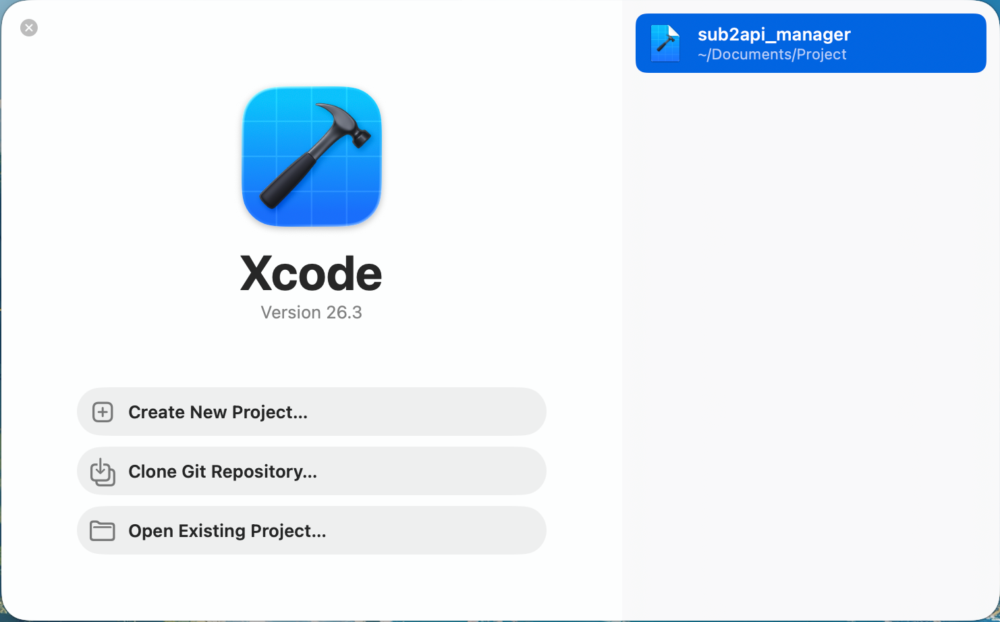
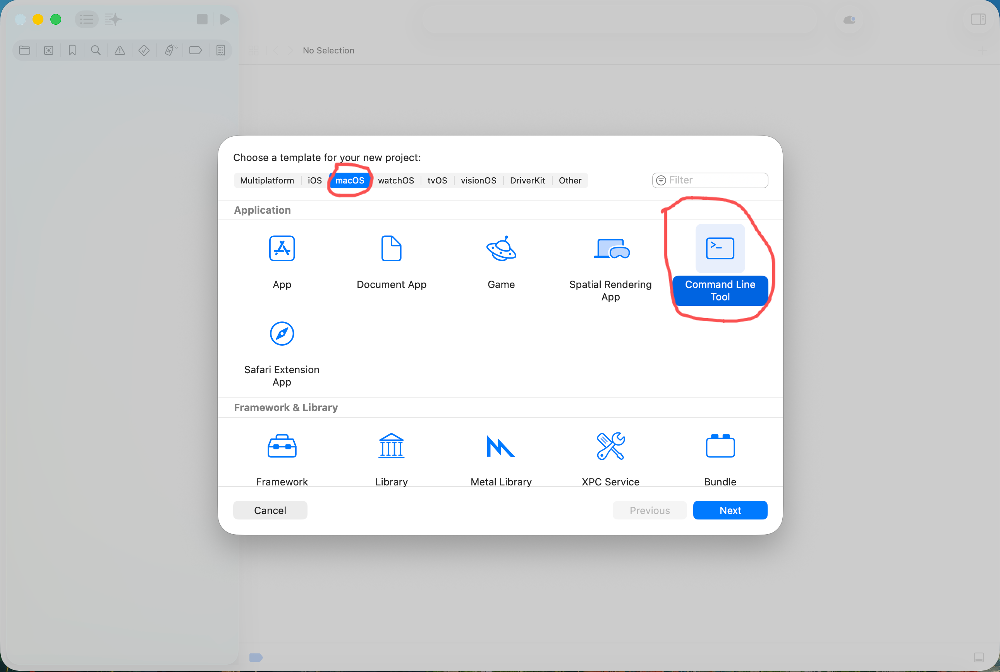
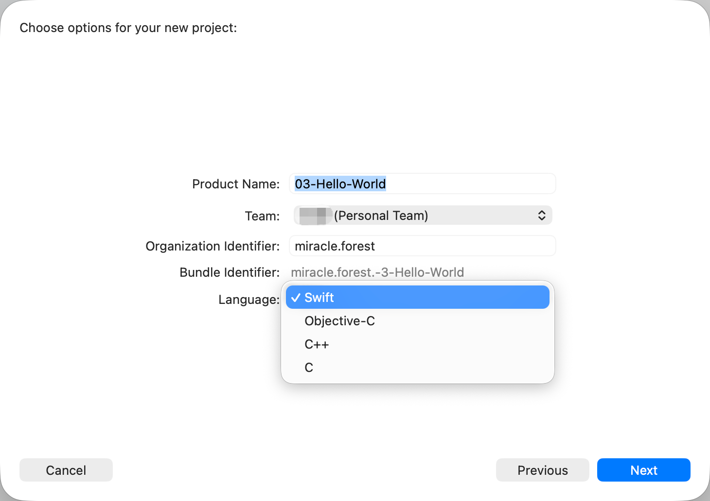
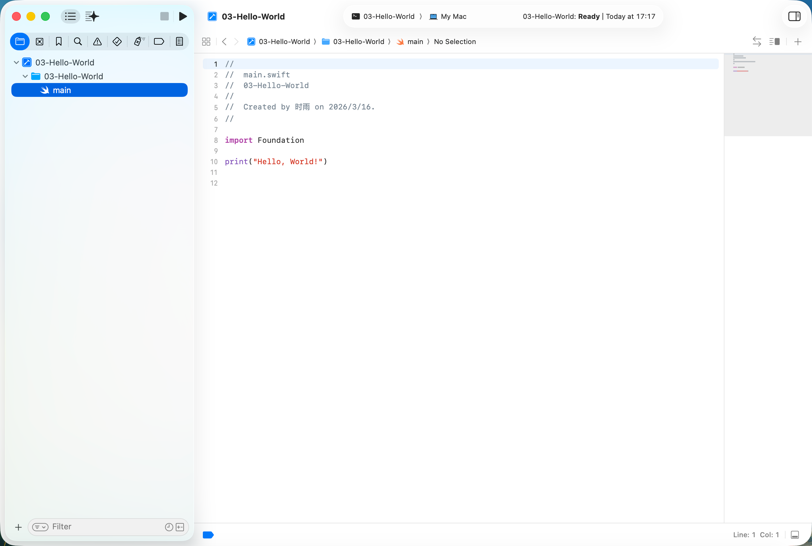
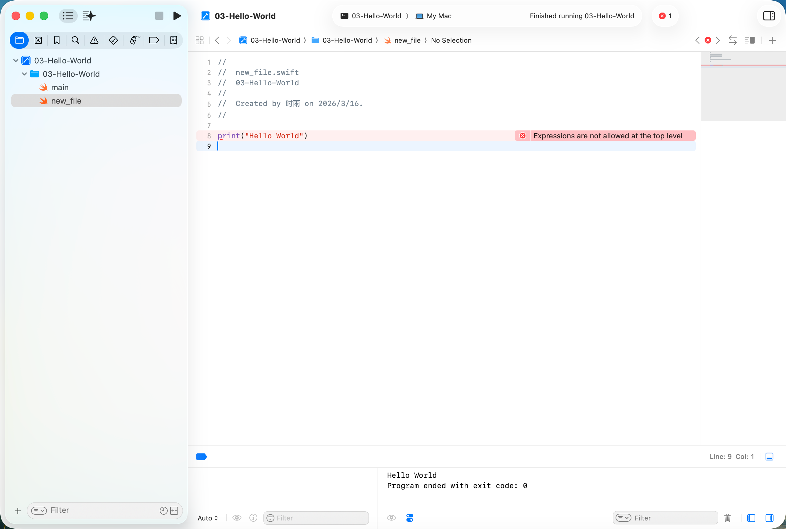
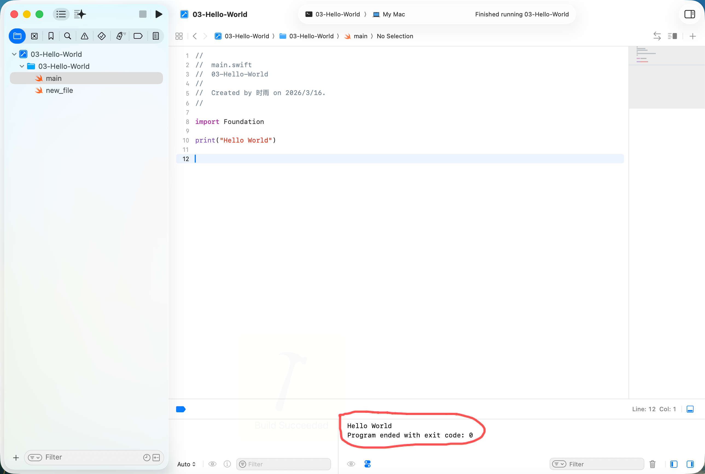
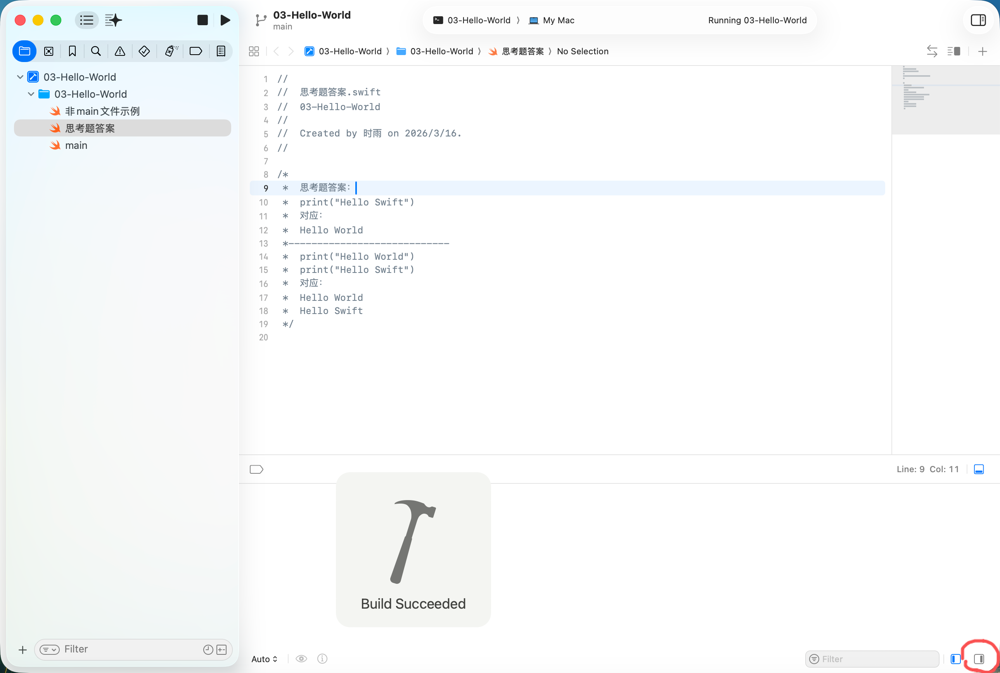

# 04. 打印 Hello World

## 阅读导航

- 前置章节：[01. 环境搭建](./01-environment-setup.md)、[02. Git 基础与拉取项目](./02-git-basics.md)、[03. Xcode 基础使用](./03-xcode-basics.md)
- 上一章：[03. Xcode 基础使用](./03-xcode-basics.md)
- 建议下一章：后续 Swift 基础语法章节（待补充）
- 下一章：后续 Swift 基础语法章节（待补充）
- 适合谁先读：已经会打开并运行 Xcode 项目的读者

## 本章目标

学完这一章后，你应该能够：

- 理解为什么这一阶段更适合先使用控制台程序
- 在 Xcode 中创建一个最基础的命令行项目
- 找到 `main.swift`
- 理解程序为什么会从这里开始执行
- 查看并运行模板自带的 `print("Hello, World!")`
- 初步建立“程序起始点”的概念

## 为什么这一章先使用控制台程序

如果现在直接从带界面的应用项目开始，初学者很容易被很多暂时用不到的内容干扰，例如：

- 额外的资源文件
- 界面相关文件
- 预览和平台配置
- 与当前语法学习无关的工程结构

但本课程当前阶段的重点还不是界面开发，而是先学会最基础的 Swift 代码。

所以，这一章我们先使用控制台程序，也就是 `Command Line Tool`。

这样做的好处很直接：

- 工程结构更简单
- 文件更少
- 更容易把注意力放在 Swift 代码本身
- 输出结果也更直观，直接看控制台即可

## 为什么从 Hello World 开始

几乎所有编程语言的入门教程，都会从一个非常简单的输出示例开始。

这不是因为 `Hello World` 本身有多重要，而是因为它能帮你快速确认三件事：

- 项目能创建
- 代码能运行
- 结果能看到

对于初学者来说，这一步非常关键。

但这一章真正更重要的内容，并不只是输出一句 `Hello, World!`，而是理解下面这个概念：

- 一个程序总要有“从哪里开始执行”的位置

在很多语言里，这个位置会被概括成：

- `main` 函数

所以这一章除了 `Hello World` 之外，更核心的是帮助你建立“程序入口”这个概念。

## 第一步：从 Xcode 欢迎页开始新建项目

打开 Xcode 后，如果当前还没有打开任何工程，通常会先看到欢迎页。



在这里，先点击：

```text
Create New Project...
```

如果你对英文界面还不熟悉，可以先记住：

- `Create New Project...`：新建项目
- `Open Existing Project...`：打开现有项目

这一章我们要做的是新建项目，所以先从 `Create New Project...` 进入。

如果你想直接对照本章已经准备好的示例工程，也可以查看课程仓库中的这个目录：

```text
demos/projects/04-hello-world-console/03-Hello-World.xcodeproj
```

## 第二步：选择控制台程序模板

进入模板选择页后，不要选择带界面的 App 模板，而是选择命令行工具模板。



这里建议你注意两点：

1. 先切换到 `macOS`
2. 选择 `Command Line Tool`

这样创建出来的项目会更适合当前这门课的入门阶段。

### 为什么这里不选 App

因为 `App` 模板通常会带来更多和界面相关的文件与配置。

而我们这一章真正想讲的只有：

- 如何写一行 Swift 代码
- 如何运行它
- 如何看到输出结果

所以，控制台程序反而是更合适的起点。

## 第三步：填写项目基本信息

选中 `Command Line Tool` 之后，Xcode 会让你填写项目的基础信息。



在这个页面中，初学者最值得关注的是下面几项：

- `Product Name`
- `Language`

### Product Name

它就是项目名。

例如你可以命名为：

```text
03-Hello-World
```

### Language

这里需要特别说明一下。

在前一章介绍一般应用模板时，我们提到过新版 Xcode 里某些项目模板可能不会再提供单独的 `Language` 选项。

但 `Command Line Tool` 这个模板不一样。对于这个模板，Xcode 仍然会让你明确选择语言，例如：

- `Swift`
- `Objective-C`
- `C++`
- `C`

而本课程当前学习的是 Swift，所以这里应当选择：

```text
Swift
```

### 其他字段要不要现在深入理解

像 `Team`、`Organization Identifier` 这类字段，在当前阶段你不需要一次完全搞懂。

你只需要先知道：

- 项目名要能认出来
- 语言要选 `Swift`

这样就足够支撑这一章继续往下学。

## 第四步：创建项目后，先看 main.swift

当项目创建完成后，Xcode 会自动打开这个工程。



这时你通常会看到一个非常简洁的工程结构。和上一章的带界面项目相比，它明显少了很多无关内容。

最重要的是，你会很快看到一个核心文件：

```text
main.swift
```

对于当前阶段来说，你可以先把它理解成：

- 这个控制台程序最直接的入口文件

也就是说，我们这一章最主要的代码，通常就会写在这里。

## 什么是程序的起始点

你可以先把程序的起始点理解成：

- 当程序开始运行时，最先会执行的那部分代码位置

在很多语言里，这个起点常常会写成 `main`：

- C++ 里常见的是 `int main()`
- Java 里常见的是 `public static void main(String[] args)`
- Python 最简单的脚本常常直接从文件顶层开始执行

而在我们当前这个控制台项目里，这个概念最直接的体现方式就是：

- `main.swift`

你可以先把它理解成：

- 当前这个 Swift 控制台项目默认从这里开始执行

## Swift 编译器如何判断程序从哪里开始

编译器并不是“随便猜”程序从哪里开始，它是按规则判断入口的。

对当前阶段来说，你可以先记住两种最常见的入口形式：

1. `main.swift`
2. `@main`

### 规则一：如果项目里有 `main.swift`

对于像这一章这样的控制台项目，最直观的情况就是项目里存在：

```text
main.swift
```

这时你可以先简单理解成：

- 编译器会把 `main.swift` 里的顶层代码当作程序入口
- 程序启动时，会先执行这里面的代码

这也是为什么在当前这个 `Command Line Tool` 项目中，你把：

```swift
print("Hello, World!")
```

写进 `main.swift` 后，一运行就能立刻看到结果。

这里还需要特别强调一个很容易混淆的点：

- 在这个控制台项目里，默认情况下编译器会运行 `main.swift`

这意味着你不能像写最简单的 Python 脚本那样，把顶层可执行代码随手放到任意一个 `.swift` 文件里。

在 Python 里，下面这种顶层代码通常可以直接执行：

```python
print("Hello, World!")
```

但在当前这个 Swift 控制台项目里，如果你把类似的顶层表达式直接写到其他普通 Swift 文件中，而不是写在 `main.swift` 里，编译器通常就会报错。



上图展示的就是这种情况：当你把 `print("Hello World")` 直接写到另一个普通 Swift 文件的顶层时，Xcode 会提示：

```text
Expressions are not allowed at the top level
```

对当前阶段来说，你只需要先记住这条规则：

- 默认情况下，这个控制台项目允许你把顶层可执行代码写在 `main.swift`
- 但不会允许你在其他普通 Swift 文件里也直接这样写

### 规则二：有些 Swift 项目会使用 `@main`

并不是所有 Swift 项目都会直接给你一个 `main.swift` 文件。

在很多现代 Swift 项目中，程序入口也可能写成另一种形式，也就是在某个类型前面加上：

```swift
@main
```

你现在可以先把它理解成：

- “从这个类型开始启动程序”

例如在后面你接触到一些 App 项目时，可能会看到类似这样的写法：

```swift
@main
struct MyApp: App {
    var body: some Scene {
        WindowGroup {
            ContentView()
        }
    }
}
```

对初学者来说，现在只需要先抓住重点：

- 这也是一种程序入口
- 它和 `main.swift` 一样，都是在告诉编译器“程序从哪里开始”

所以当前这一章先从 `main.swift` 入手，是因为它最直接、最容易看懂。

## 什么是 print

在 Swift 中，`print` 是一个非常常见的输出工具。

你可以先把它理解成：

- 把一段内容显示到控制台里

例如：

```swift
print("Hello, World!")
```

这段代码现在只需要先理解到这一层就够了：

- 它会把一段文本输出到控制台

更细的参数和输出行为，我们放到后面的 IO 相关章节再讲。

## 为什么把 Hello World 写在 main.swift 里就会生效

现在你可以把这一章最核心的逻辑理解成这样：

1. `main.swift` 是当前控制台程序的起始位置
2. 程序启动时，会先执行这里面的代码
3. 这里面有一句 `print("Hello, World!")`
4. 所以运行后，控制台里就会出现 `Hello, World!`

这一章你真正需要建立的是：

- 代码之所以执行，是因为它处在程序入口中

## 输出结果会显示在哪里

对于 `Command Line Tool` 来说，`print` 的结果通常会直接显示在 Xcode 的控制台区域。

所以你可以先记住这一点：

- 代码写在 `main.swift`
- 结果看控制台



上图展示的就是一个典型的成功运行结果。对当前阶段来说，你最需要关注的是控制台里已经出现了：

```text
Hello World
```

这说明模板中的输出代码已经真正被执行了。

这也是为什么控制台项目特别适合入门。它没有太多界面干扰，你写的输出会非常直接地显示出来。

而如果你看到的是 `Build Succeeded`，但没有立刻看到输出内容，也不要马上怀疑代码有问题。先检查一下是不是把底部输出栏折叠起来了。



上图展示的就是一种常见情况：程序已经成功运行，但底部输出区域被收起了，所以你暂时看不到控制台里的文本结果。

## Hello World 示例

这一章最基础的示例就是：

```swift
print("Hello, World!")
```

Xcode 为这个控制台项目默认生成的模板里，通常已经自带了这句代码。

如果程序运行正常，你通常会在控制台中看到：

```text
Hello, World!
```

这说明当前至少有下面几件事是正常的：

- 控制台项目已经创建成功
- 程序已经从 `main.swift` 开始执行
- Swift 代码被成功执行了
- 控制台输出也已经正常工作

## 初学者在这一章最容易犯的错误

### 1. 选错模板

如果你一开始选成了带界面的 `App` 模板，那么你会看到更多界面文件和配置，学习负担会明显变大。

当前这一章最稳妥的做法仍然是先用 `Command Line Tool`。

### 2. 在 Language 里选错语言

对于 `Command Line Tool` 模板，这里会明确提供语言选项。

如果你没有选择 `Swift`，后面看到的代码结构就会和本教程不一致。

### 3. 使用了中文引号

错误示例：

```swift
print(“Hello, World!”)
```

这里的引号看起来很像对的，但它不是代码里常用的英文双引号。

正确写法应该是：

```swift
print("Hello, World!")
```

## 本章小结

学完这一章后，你应该已经理解了：

- 为什么当前阶段更适合先使用控制台程序
- 如何在 Xcode 中选择 `Command Line Tool`
- 为什么这个模板能减少界面文件的干扰
- `main.swift` 是当前这个控制台程序最直接的起始位置
- 很多语言会把这种“程序从哪里开始执行”的概念称为 `main`
- `print("Hello, World!")` 是用来验证程序入口和输出是否正常的最基础示例

从这一章开始，你就正式看懂并运行了自己的第一段 Swift 控制台代码。

## 本章练习

请你自己完成下面几件事：

1. 在 Xcode 欢迎页中点击 `Create New Project...`
2. 选择 `macOS` 下的 `Command Line Tool`
3. 在 `Language` 中选择 `Swift`
4. 创建项目后打开 `main.swift`
5. 观察模板默认生成的 `print("Hello, World!")`
6. 点击运行
7. 在控制台确认你看到了 `Hello, World!`

如果你能顺利完成这几步，说明你已经正式完成了第一段 Swift 控制台程序的运行。

## 课后思考题

请在理解本章内容的基础上，自己尝试让终端分别输出下面两段内容：
```text
Hello Swift
```

```text
Hello World
Hello Swift
```

这题的用意并不是机械修改文本，而是希望你们思考下面这个问题：

- 已知当前程序从 `main.swift` 开始执行，该如何控制多行代码的顺序来达到我们想要的效果？

当你成功看到这两行输出时，就说明你不仅看到了程序入口，还开始接触到“程序会按照书写顺序依次执行”的运行流程概念。

而如果你没有成功实现，也无需气馁，可以查看本节课对应的课件中的`思考题答案.swift`，希望通过阅读它可以让你更好地理解程序的运行流程：

```text
demos/projects/04-hello-world-console/03-Hello-World/思考题答案.swift
```
